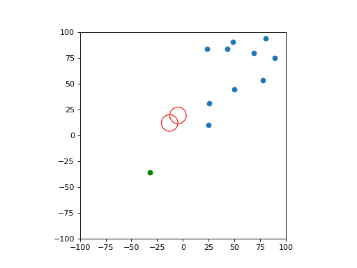

# Swarms Simulation (Data generated from this repo will be used for GNN training)

Data generation for swarm simulation
Original implementation is taken from Siyu Zhou (https://github.com/siyuzhou)

Two Boids with two obstacle and one goal data generation
```bash
python swarm_sim_data_generate.py 
```

B: No. of Boids                                    #default:2  
OBST: No. of obstacles                             #default:2
N_STEPS: No. of steps for which data is generated  #default:200 


Data can be generated for variable Boid and Obstacles to specific directory
python swarm_sim_data_generate.py --boids B --obstacles OBST --steps N_STEPS --save-dir /path/to/save/location/

### Files Generated
*_edge.npy: Edge type data   
*_time.npy: Time steps(dt)  
*_timeseries.npy: N_STEPS x N x D tensor  

N: Goal + No. of obstacles + No. of Boids          ---- 1 + 2 + 2
D: State vector in form of (position, velocity)    ---- 4 values

## Edge types
Edge types of the directed graph represent the influences between
elements of the system.
```
Goal = 1, Obstacle = 2, Boid = 2

|      |Goal|Obst|Obst 1|Obst 2|Boid 1|Boid 2|  
|Goal  | 0  | 0  | 0    | 0    | 1    | 1    |  
|Obst 1| 0  | 0  | 0    | 0    | 2    | 2    |
|Obst 2| 0  | 0  | 0    | 0    | 2    | 2    |
|Boid 1| 0  | 0  | 0    | 0    | 0    | 3    |  
|Boid 2| 0  | 0  | 0    | 0    | 3    | 0    |  


```

## Boid



